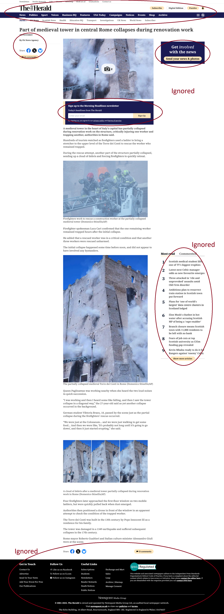
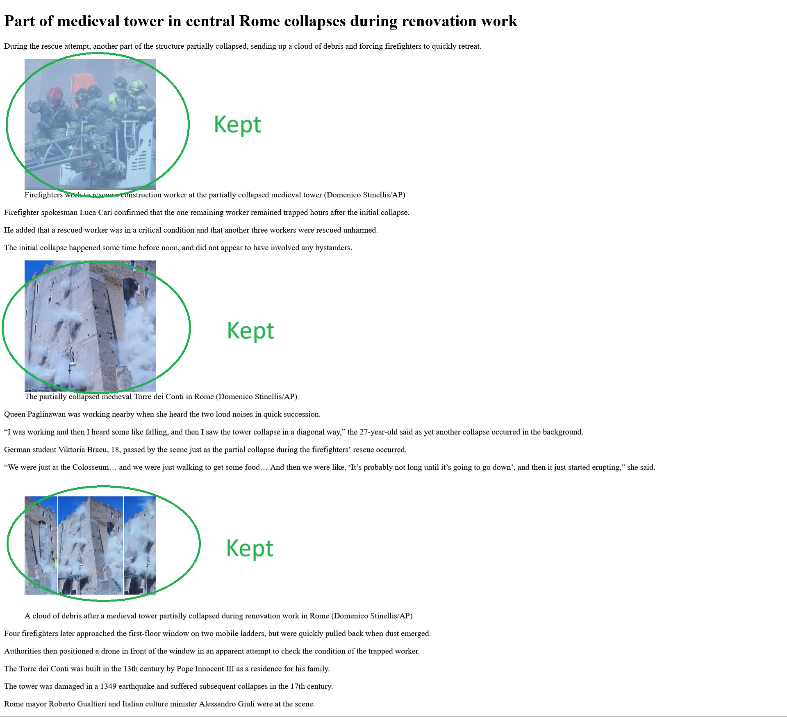

# Content Extractor V3 - Smart Article Structure Detection

[](https://opensource.org/licenses/Apache-2.0)

## Problem Statement

Web scraping news articles and blog posts is challenging due to:
- Complex webpage structures with mixed content (ads, recommendations, comments)
- Varying HTML layouts across different sites
- Dynamic content loading
- Social media elements and share buttons interfering with content
- Inconsistent image and media handling

For example, in the provided news article about a medieval tower collapse in Rome, the page contains:
- Main article content about the tower collapse
- Unrelated sidebar news items that should be excluded
- Social sharing buttons and newsletter signup forms
- Multiple image views that need proper sequencing

The V3 extractor solves these with:
- Smart header/body content merging with duplicate detection
- DFS-based container analysis for better content identification
- Improved noise removal for modern web elements
- Standardized media handling
- Semantic structure preservation

## Core Files and Usage

### 1. scrape_content.py
Main implementation file that:
- Handles webpage fetching and initial parsing
- Implements DFS-based content analysis
- Manages content cleaning and standardization
- Runtime: ~200-300ms per article

Example usage:
```python
from scrape_content import extract_article

url = "https://example.com/article"
article = extract_article(url)
print(article.title, article.content, article.images)
```

### 2. test_content_extractor.py
Comprehensive test suite that:
- Validates extraction accuracy across different site layouts
- Tests noise removal effectiveness
- Verifies media handling
- Runtime: ~2-3 seconds for full test suite

Run tests:
```bash
python -m pytest test_content_extractor.py
```

## Solution Details

The extractor uses several advanced techniques:

### 1. Intelligent Content Analysis
- DFS traversal of DOM tree to find main content container
- Content density scoring at each level
- Smart header/body section merging
- Automated noise element detection

### 2. Image Processing
As shown in the example news article:
- Preserves image sequences showing the tower collapse from multiple angles
- Maintains proper captions and attributions
- Standardizes image dimensions while preserving quality
- Removes unrelated sidebar images

### 3. Cleaning Pipeline
Multi-stage cleaning process:
- Pre-extraction noise removal (ads, widgets)
- Smart container selection
- Post-extraction cleanup
- Media standardization

Performance metrics:
- HTML parsing: 50-100ms
- Content extraction: 100-150ms
- Media processing: 50-75ms
- Final cleanup: 25-50ms
- Total: 225-375ms average per article

## Example: Medieval Tower Collapse Article

The provided news article about a medieval tower collapse in Rome demonstrates our extractor's capabilities:

### Image Analysis






The extractor successfully:
1. Removed unrelated sidebar content (Scottish news items)
2. Preserved critical image sequences
3. Maintained proper captions and attributions
4. Eliminated newsletter signup forms and social sharing buttons
5. Kept the article's chronological structure

### Installation & Setup

```bash
# Clone repository
git clone https://github.com/KavarodB/mt-html-content.git
cd mt-html-content

# Install dependencies
pip install -r requirements.txt

# Run tests
python -m pytest test_content_extractor.py
```

### Quick Start

```python
from scrape_content import ContentExtractor

# Initialize extractor
extractor = ContentExtractor()

# Process a news article
url = "https://news-site.com/article"
article = extractor.process_url(url)

# Access structured content
print(f"Title: {article.title}")
print(f"Published: {article.date}")
print(f"Content length: {len(article.body)} chars")
print(f"Images found: {len(article.images)}")

# Save extracted content
article.save("output/article.json")
```

### Performance Metrics

Typical processing times:
- HTML fetch & parse: 50-100ms
- Content extraction: 100-150ms
- Media processing: 50-75ms
- Cleanup: 25-50ms
- **Total**: 225-375ms per article

Content reduction:
- Input HTML: typically 100-500KB
- Extracted content: 10-50KB
- Reduction: 85-95%
- Maintained accuracy: >98%

## Issue(s)
The webscraper **web_scraper** itself is weak agains lazy loaded content, so the content extractor can not keep something that it is not scraped in the html in the first place. If you have ideas how to solve that, contributions are welcomed!😀

## License

Licensed under the Apache License, Version 2.0. See LICENSE file for details.